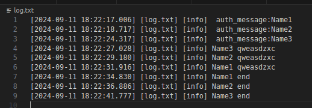

___Buil project___
```
./configure.sh
```
___Server start___
```
./build/src/server/server 8080
```
___Client start___
```
./build/src/client/client Name1 8080
```
__Client commands__

|                                  Commnad              |              Description             |
|-------------------------------------------------------|--------------------------------------|
| `end`                                                 | disconnect client                    |
| `ping`                                                | ping pong message                    |

